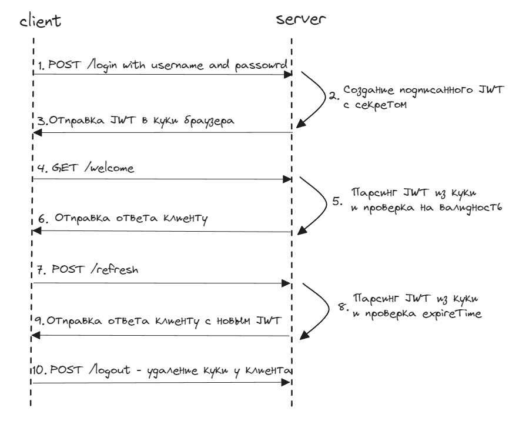

# Создание JWT ауентификации с сохранением токена в куки клиента

***

1. Склонируйте репозиторий на вашу локальную машину:

   ```bash
   git clone https://github.com/Jhnvlglmlbrt/jwt-auth

2. Перейдите в директорию проекта:

   ```bash
   cd jwt-auth

3. Установить зависимости:
    
    ```bash
    go get 

4. Запустите код: 

    ```bash
    make run

***
### Структура приложения



1. Клиент (фронтенд) переходит на маршрут, предназначенный для входа - '/login' со своими данными.

2. Декодируем данные из запроса, сравниваем предоставленный пароль (из creds) с ожидаемым паролем в бд (в нашем случае в map). Затем создаём подписанный токен с claims.

3. Отправляем подписанный токен в куки клиента.

4. GET запрос на '/welcome'.

5. Парсинг JWT токена из куки и проверка на валидность.

6. Отправка ответа клиенту с данными пользователя - Username и вывод на экран.

7. POST запрос на '/refresh'.

8. Парсинг JWT токена из куки, проверка на валидность и время истечения токаена. 
    Если до конца истечения времени JWT осталось меньше определённого количества времени, то токен можно обновить, иначе - ошибка StatusBadRequest.

9. В случае удачного обновления JWT токена - отправка клиенту в куки нового JWT токена.

10. Также есть возможность удалить JWT - установить expireTime на time.Now() - токен моментально устареет и пользователю придётся заново логиниться.
